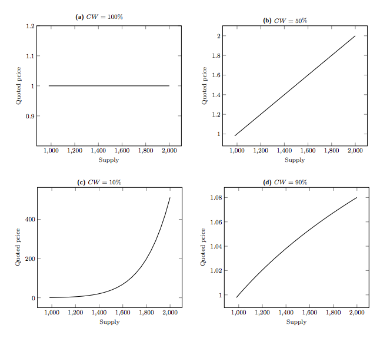

# Bonding Curve

Bonding Curve 是一个通过预先设定的曲线，来确定 Token 供应量与 Token 价格关系的函数曲线。
即 Token 价格 = f(Token 供应量)。

特点： 价格很难被恶意操纵。
项目方不能通过保留 99% 的代币实现砸盘。

在 Bonding Curve 上，所有的 Token 都是通过将锚定资产打入铸造合约来铸造产生的。
比如用 ETH 作为锚定资产铸造 Token 代币：

- 打入 ETH，获得 Token 代币
- 代入 Token 代币，获取 ETH

ETH 所需的数量和 Token 代币的数量由 Bonding Curve 决定。


要得到在 Bonding Curve 下两种代币之间的关系，我们需要对曲线函数进行积分计算。
比如对于函数曲线 $y = m x^n$（m，n是常数），购买 $dx$ 代币的花费 $dp = y * dx$, 因此如果想在价格为 x 的时候买如 k 个代币，则需要的花费是：


因此有 k 和 p 的关系为：


其中 $Rb = m*x^{(n+1)}/(n+1)$ 表示锚定资产余额， $r = 1/(n+1)$ 表示锚定资产比例。

例如 $n=2$，$m=0.003$ 时有


以及对应的 solidity 代码：

```solidity
    function calculatePurchaseReturn(
        uint256 _totalSupply,
        uint256 _depositAmount
    ) public pure returns (uint256) {
        uint256 temp = 1000*_depositAmount + _totalSupply*_totalSupply*_totalSupply;
        temp = powerOneThird(temp); // temp^(1/3)
        
        return temp - _totalSupply;
    }

```

在实际情况中，我们使用[Bancor Bonding Curve 公式](https://drive.google.com/file/d/0B3HPNP-GDn7aRkVaV3dkVl9NS2M/view)来简化计算和避免整数计算溢出。

定义 $$ F = \frac{R}{S * P}$$

其中：

- F： 表示锚定资产比例
- R： 表示锚定资产数量
- S： Token 的供应量
- P： Token 的价格

锚定资产比例 = 1 是常数价格曲线。
锚定资产比例 = 1/2 是线性价格曲线。
锚定资产比例 < 1/2 是下凹价格曲线。
锚定资产比例 > 1/2 是上凸价格曲线。



我们还可以得到两个公式：

计算使用锚定资产（$E$）买入Token的数量（$T$）：

$$ T = S((1+ \frac{E}{R}) ^ F - 1)$$

计算卖出Token数量（$T$）所得到的锚定资产（$E$）：

$$ E = R(1-(1-\frac{T}{S})^{\frac{1}{F}})$$

参考：

- https://medium.com/relevant-community/bonding-curves-in-depth-intuition-parametrization-d3905a681e0a
